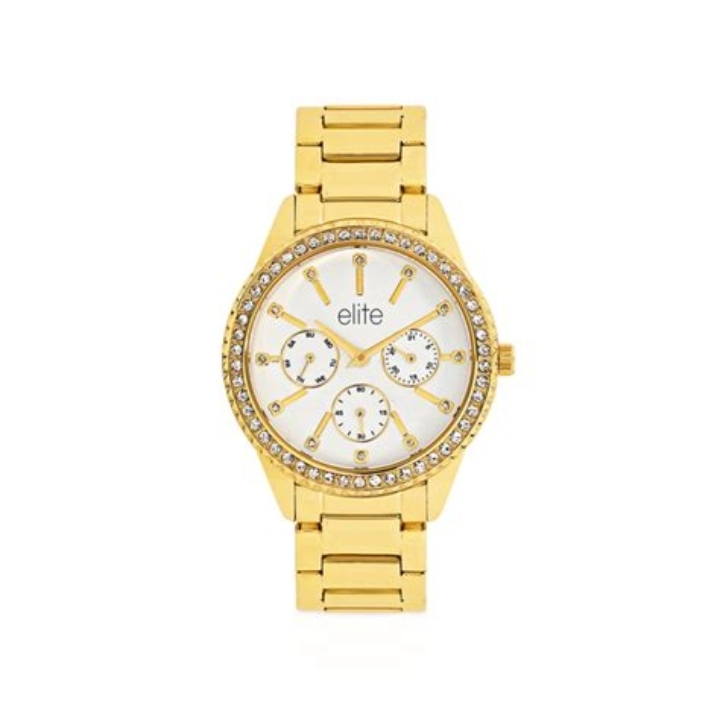

# luxoria
LUXORIA is a premium, elegant product showcase webpage featuring an exclusive collection of luxury items.

**Features**

Responsive Design – Adapts to all screen sizes.

High-Quality Product Cards – Showcasing luxury watches, shoes, handbags, sunglasses, and perfumes.

Modern & Minimalist UI – Sleek and premium feel.

**Technologies Used**

HTML – Structure

CSS – Styling

JavaScript – For interactivity

***Installation**

1. Clone this repository:

git clone https://github.com/sharek32/luxoria.git

2. Open index.html in a browser.

**Fixing Image Issues**

Ensure images are correctly named and placed in the img/ directory. Update the  sources like this:

----

**Contribution**

Contributions are welcome! Feel free to fork this project and submit pull requests.

**License**

This project is licensed under the MIT License.
